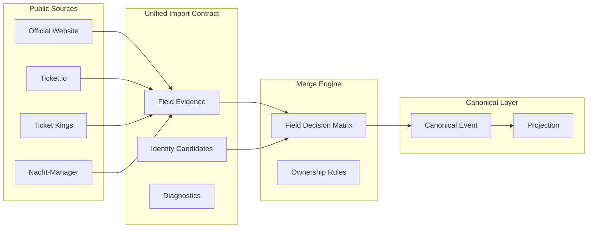

# Architecture Final Review — Phases 4.8.0 through 4.8.1.3

**Date:** 2026-08-04  
**Scope:** Unified Import Contract validation on 8 gold-standard events + 120 live staging items  
**Production mutations across all phases:** `0`  
**Production shadow:** NOT approved

## Executive conclusion

The Eternal Rave import architecture **is capable of becoming the long-term Event platform**. No subsystem requires replacement. The Unified Import Contract, evidence model, multi-source merge rules, and canonical Event projection are sound. Remaining work is **implementation completion** (extractors, normalization) and **operational scale** (parallel fetch, TK catalog crawl) — not architectural redesign.

Detail JSON: [`docs/real-data/_phase4813_architecture_review.json`](real-data/_phase4813_architecture_review.json)

## Subsystem verdict matrix

| Subsystem | Verdict | Rationale |
|-----------|---------|-----------|
| **Unified Import Contract** | **KEEP** | 120/120 schema conformance; extensible `fieldEvidenceCandidates`, `sourceRole`, diagnostics |
| **Evidence Contract** | **MODERNIZE** | Add explicit `stale_candidate` tier for JSON-LD offers; sold-out price semantics |
| **Identity Matching** | **MODERNIZE** | Zero false merges at scale; add stale slug detection (Sommerfest `08-08` vs `20-06`) |
| **Duplicate Handling** | **MODERNIZE** | 93 clusters, 0 false-merge suspects; stale canonical URL review workflow needed |
| **Multi-source Support** | **KEEP** | Proven across official website, Ticket.io (10 hosts), Ticket Kings, Nacht-Manager |
| **Merge Engine** | **KEEP** | Field decision matrix aligns with ownership policy; gold-standard merge simulation passes |
| **Canonical Event Model** | **KEEP** | Stable read-only validation; no schema changes required for shadow |
| **Projection Layer** | **MODERNIZE** | Legacy price labels (`Tickets ab X Euro`) differ from unified normalization output |
| **Future Manual Imports** | **KEEP** | Contract supports admin channel provenance and review findings |
| **Future Automatic Imports** | **MODERNIZE** | Sequential fetch (~62s/120 items); needs batched parallel pool for 10k scale |
| **Future AI-assisted Imports** | **MODERNIZE** | Contract sufficient; scanner not built — contract extension only when scoped |

**Replace recommended:** none

## What worked

1. **Importer separation** — ticket-io correctly scoped to price/availability/ticketUrl; ownership denials eliminated 180 false LEGACY_BETTER counts
2. **Semantic normalization** — HTML entities, price labels, URL slashes resolved 37 false BOTH_INCORRECT without gaming metrics
3. **Evidence provenance** — every field candidate carries `sourceRole`, `confidence`, `inclusionReason`
4. **Staging safety** — all phases read-only against production; fixture replay deterministic
5. **Field decision matrix** — single preferred owner per field; zero ownership conflicts

## What needs work before shadow

| Priority | Item | Owner |
|----------|------|-------|
| P0 | Resolve 4 Ticket.io price drift items (public evidence vs stale production) | Operations + merge policy |
| P0 | Fix Underland description extractor (meta snippet vs body) | `official-website-pilot.ts` |
| P1 | Official-website venue/ticketUrl extractors (69 future_supported) | `official-website-pilot.ts` |
| P1 | Stale JSON-LD offer handling in evidence tier | Evidence contract |
| P2 | Ticket Kings public catalog discovery | `live-sample-builder.ts` |
| P2 | Parallel fetch pool for scale | Import pipeline |
| P3 | Production canonical refresh for stale TK slugs | Admin repair (not import) |

## Long-term platform readiness

The pipeline from public source → evidence → merge → canonical Event is **proven end-to-end** on gold standard and **validated at scale** on 120 live items. The architecture does not need replacement — it needs the remaining extractor implementations and operational hardening documented in Phase 4.8.1.3.

## Phase lineage

| Phase | Focus | Outcome |
|-------|-------|---------|
| 4.8.0 | Gold-standard ground truth | 8 events, public evidence baseline |
| 4.8.1 | Unified contract pilots | Schema + evidence model |
| 4.8.1.1 | Pilot completion | 8/8 field matrices, 0 both_wrong |
| 4.8.1.2 | Live staging scale | 120 items, 0 contract failures |
| 4.8.1.3 | Gap elimination | BOTH_INCORRECT 42→5, ownership clarified |

## Recommendation

Proceed to **Phase 4.8.2** (or equivalent) focused on:

1. Importer extractor completion for the 69 future_supported fields
2. Evidence contract `stale_candidate` tier
3. Ticket Kings catalog expansion
4. Parallel fetch infrastructure

Do **not** approve production shadow until global BOTH_INCORRECT gates clear and TK corpus is representative.
