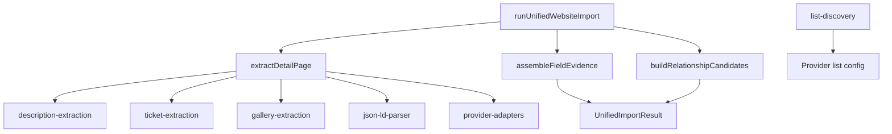

# Architecture — Unified Official Website Importer

**Version:** `phase484-unified-website-v1`  
**Contract:** `UnifiedImportResult` / `FieldEvidenceCandidate` (Phase 4.8.1)  
**Mode:** Staging-only pilot — not registered in production connector registry

## Design Principles

1. **Generic core, provider adapters at the edge** — no Bootshaus-specific logic in core modules.
2. **Full provenance** — every extracted value becomes a `FieldEvidenceCandidate` with `extractionStrategy`, `originUrl`, `observedAt`, `importerVersion`.
3. **Public HTML is truth** — prefer visible body content over meta tags; never invent ticket URLs from prose.
4. **No writes** — importer emits evidence only; merge and publish are out of scope.

## Module Map



### Core (provider-agnostic)

| Module | Responsibility |
|---|---|
| `unified-website-importer.ts` | Entry point; builds `UnifiedImportResult` |
| `detail-extraction.ts` | Single detail page → structured `DetailPageExtraction` |
| `description-extraction.ts` | Body-first description chain with source attribution |
| `description-boilerplate.ts` | Footer / promo stripping after normalization |
| `ticket-extraction.ts` | CTA-first ticket URL discovery |
| `gallery-extraction.ts` | Flyer + gallery image URLs |
| `html-meta.ts` | OG / meta readers |
| `list-discovery.ts` | Generic list-page URL harvest |
| `relationship-extraction.ts` | Organizer, promoter, venue, official_page candidates |
| `evidence-assembler.ts` | `FieldEvidenceCandidate` assembly + stale ticket policy |

### Provider adapters (`provider-adapters.ts`)

Adapters supply **configuration and optional extractors only**:

| Adapter | Host | List discovery | Custom extractors |
|---|---|---|---|
| `bootshaus` | `bootshaus.tv` | Upcoming events on homepage | Genre tag container |
| `affenkaefig` | `affenkaefig.info` | `/tickets/` list | — |
| `ticket_kings` | `ticketkings.de` | Event index | Tribe event categories |

Adapters must not be imported by core extraction modules except through `resolveProviderAdapter(url)`.

## Description Pipeline

```
event-description-content (Bootshaus)
  → ecm-event-single__content (Affenkäfig ECM)
  → tribe-events-single-event-description (TicketKings)
  → JSON-LD description
  → og:description / meta description
```

After raw extraction:

1. `normalizeCanonicalEventDescription()` — shared with publish path
2. `stripDescriptionBoilerplate()` — cut at dividers, age footer, app/merch blocks

## Ticket Pipeline

```
HTML CTA anchors (class/href signals)
  → JSON-LD Offer.url
  → Self-referential TicketKings event URL (page is checkout)
```

Rejected: `bit.ly`, merchandise URLs, shop root without event slug, prose-derived links.

When multiple TicketKings URLs appear on a page, the URL matching the current page path wins.

## List Discovery

Provider adapters declare:

```typescript
listDiscovery: {
  listPageUrl: string;
  eventLinkPattern: RegExp;
  strategy: string;
}
```

`discoverEventUrlsFromListPage(html, …)` returns absolute event URLs with diagnostics. List discovery is implemented but **not wired to scheduling** in this phase.

## Output Contract

`runUnifiedWebsiteImport()` returns:

- `fieldEvidenceCandidates` — all supported domains with provenance
- `relationshipCandidates` — organizer, promoter, venue, official_page
- `extractionDiagnostics` — rejections, stale ticket warnings
- `eventIdentityCandidates` — URL + title + start signals
- `stagingOnly: true`, `pilotOnly: true`

## Integration Boundary (Phase 4.8.5)

| Layer | Current | Next phase |
|---|---|---|
| Connector registry | Legacy `websiteProcessor` | Register `unified-website` connector |
| Pilot entry | `runOfficialWebsitePilotForEvent` | Production import service |
| Publish | None | `FieldTrustMergeService` bridge |
| Scheduling | None | Reuse existing source schedules |

## Testing

- Unit: `src/features/import/unified-website/__tests__/unified-website-importer.test.ts`
- Regression: `src/features/import/shadow/__tests__/phase482-shadow-comparison.test.ts`
- Gold standard ops: `scripts/operations/_phase484-unified-website-importer.ts`

## Related Documents

- `docs/PHASE_484_UNIFIED_WEBSITE_IMPORTER_COMPLETION.md` — phase report
- `docs/GENERIC_TICKET_PLATFORM_ARCHITECTURE.md` — broader import architecture
- `docs/real-data/_phase484_*.json` — validation artifacts
