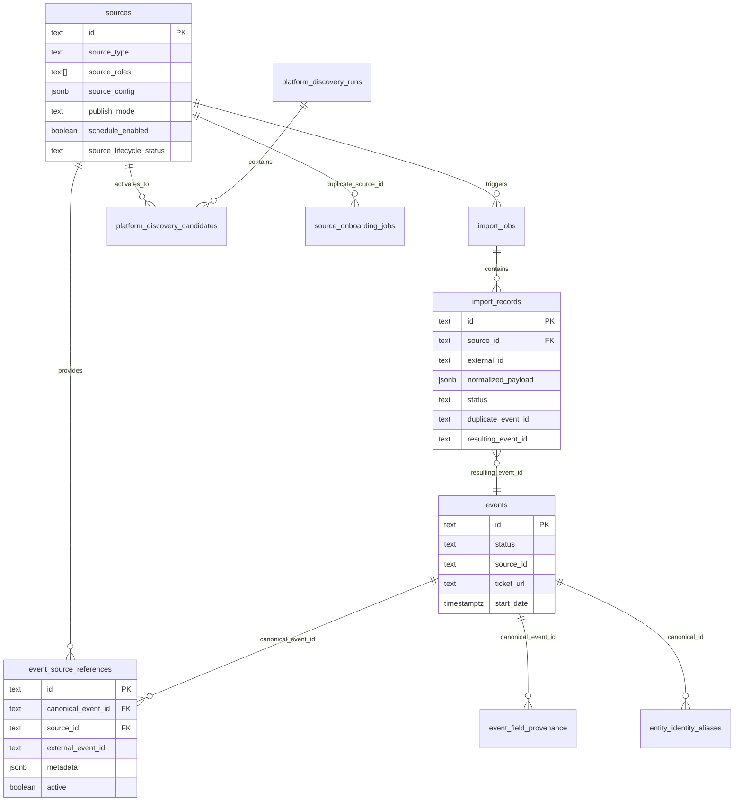

# Eternal Rave — Generic Source Platform Masterplan

**Phase:** 1 — Audit only (no code changes)  
**Date:** 2026-07-31  
**Reference implementation:** Bootshaus website (`source-bootshaus-koeln`)  
**First production ticket connector:** Ticket.io (`source-bootshaus-ticket-io`)  
**Deprecated platform:** Ticket Kings — see [TICKET_KINGS_DEPRECATION_PLAN.md](./TICKET_KINGS_DEPRECATION_PLAN.md)

---

## Executive Summary

Eternal Rave already has a **working generic import pipeline** from connector fetch through canonical event publish. Bootshaus demonstrates the desired end-to-end flow with `auto_publish`. Ticket.io uses the **same pipeline** but is configured as **enrichment** (`manual_review`, fill-only merge) — not because the architecture differs, but because of source policy.

The gap is not “a separate Ticket.io pipeline” but:

1. **Incomplete generic abstractions** (source types, field-trust merge, dynamic scheduling)
2. **Ticket.io scoped to one shop** (Bootshaus enrichment, not multi-shop discovery at scale)
3. **Ticket Kings still active** (duplicate work, strategic deprecation pending)
4. **Field ownership policy exists but is not wired** into publish merge
5. **Consumer UI does not surface multi-origin data** (only `events.ticket_url`)

---

## 1. Current Architecture

### 1.1 Layered model (as implemented)

```
┌─────────────────────────────────────────────────────────────────┐
│  Source (DB: public.sources)                                    │
│  - source_type, source_roles, source_config, publish_mode       │
│  - schedule_policy, trust_score, lifecycle_status               │
└───────────────────────────┬─────────────────────────────────────┘
                            │
┌───────────────────────────▼─────────────────────────────────────┐
│  Connector (aggregation/connectors/)                            │
│  resolveSourceConnectorKey() → SourceConnectorRegistry          │
│  club_website | organizer_website | ticket_platform | …         │
└───────────────────────────┬─────────────────────────────────────┘
                            │ RawImportedEvent[]
┌───────────────────────────▼─────────────────────────────────────┐
│  AggregationPipeline                                            │
│  fetch → normalize → validate → duplicate_check → merge →       │
│  review → publish (eligibility markers only)                    │
└───────────────────────────┬─────────────────────────────────────┘
                            │ CanonicalImportEvent per envelope
┌───────────────────────────▼─────────────────────────────────────┐
│  ImportAggregationService                                       │
│  matching → import_records upsert → publish orchestrator        │
└───────────────────────────┬─────────────────────────────────────┘
                            │
         ┌──────────────────┼──────────────────┐
         ▼                  ▼                  ▼
  ImportReviewService  ImportPublishOrchestrator  EventLifecycleOrchestrator
  (manual path)        (auto_publish path)        (archive missing)
         │                  │
         └────────┬─────────┘
                  ▼
  ImportEventPublishService.publishRecord()
    → AdminEventRecord (events table)
    → EventOriginService (event_source_references)
    → EventCanonicalIdentityService (entity_identity_aliases)
    → EventFieldProvenanceWriter (event_field_provenance)
                  │
                  ▼
  Public: EventRepository.getPublishedEvents()
    → discovery-feed-helpers.getDiscoverablePublishedEvents()
    → Frontend / Discovery API
```

**Wiring:** `src/data/repositories/registry.ts` — all services composed here.

### 1.2 Normalized Source Event contract

The shared post-extraction shape is **`CanonicalImportEvent`**:

- **File:** `src/features/aggregation/domain/canonical-import-event.ts`
- **Produced by:** `NormalizeStep` → `mapNormalizedCandidateToCanonical()`
- **Input:** `NormalizedEventCandidate` (`src/features/import/models/normalized-event-candidate.ts`)
- **Fields:** `externalId`, `title`, `startDate`, `endDate`, `venueName`, `organizerName`, `ticketUrl`, `imageUrl`, `genreNames`, `artistNames`, `sourceMetadata`, `rawSourceType`, etc.

**Bootshaus already produces this contract.** Website connector (`ClubWebsiteConnector` → `website/processor.ts`) extracts events; `NormalizeStep` maps to `CanonicalImportEvent`. Verified by `CanonicalImportEvent` interface and pipeline tests.

**Ticket.io also produces the same contract.** `TicketPlatformConnector` → `fetchTicketPlatformEvents()` → `toNormalizedTicketFields()` (`normalize-ticket-event.ts`) → same normalize path. Difference is `sourceMetadata.enrichmentSource: true` set in `ticket-platform-fetch.ts`.

### 1.3 Production sources (concrete)

| Source ID | Connector | Type | Publish mode | Role |
|-----------|-----------|------|--------------|------|
| `source-bootshaus-koeln` | `club_website` | `website` | `auto_publish` | Primary calendar |
| `source-affenkaefig` | `organizer_website` | `website` | `manual_review` | Primary organizer |
| `source-bootshaus-ticket-io` | `ticket_platform` | `ticket_platform` | `manual_review` | Ticketing enrichment |
| `source-affenkaefig-ticket-kings` | `ticket_platform` | `ticket_platform` | `manual_review` | Ticketing enrichment (**deprecated**) |

**Migrations:** `20260744000000_sprint13` (Bootshaus), `20260761000000_sprint281` (Affenkäfig live), `20260763000000_sprint31` (Ticket.io), `20260764000000_sprint32` (Ticket Kings).

**TS mirrors:** `production-source-records.ts`, `ticket-io-source.core.ts`, `ticket-kings-source.core.ts`, `affenkaefig-source.ts`.

### 1.4 Connectors (registered)

**Registry:** `src/features/aggregation/connectors/source-connector-registry.ts`  
**Resolution:** `src/features/aggregation/connectors/source-connector-resolution.ts`

| Connector key | Class | File |
|---------------|-------|------|
| `club_website` | `ClubWebsiteConnector` | `club-website-connector.ts` |
| `organizer_website` | `OrganizerWebsiteConnector` | `organizer-website-connector.ts` |
| `ticket_platform` | `TicketPlatformConnector` | `ticket-platform/ticket-platform-connector.ts` |
| `ical_feed`, `rss_feed`, `atom_feed`, `csv_import`, `open_data_api`, `manual_reference` | respective classes | root connectors/ |

**Ticket platform adapters** (parse only, not separate connectors):

- `ticket-io-adapter.ts` — `parseTicketIoShopHtml()`
- `ticket-kings-adapter.ts` — `parseTicketKingsShopHtml()` (deprecated)
- `adapter-registry.ts` — `getTicketPlatformAdapter(platform)`

### 1.5 Database (core tables)

| Table | Purpose | Key migration |
|-------|---------|---------------|
| `sources` | Configured sources (~40+ columns) | `20260719000000` + ER-012 + Sprint 13–16 |
| `import_jobs` | Per-run execution | `20260720000000` |
| `import_records` | Staged source events | `20260720000000` + matching/review extensions |
| `import_job_queue` | Scheduler queue | `20260746000000` |
| `scheduler_runs` | Scheduler audit | `20260746000000` |
| `events` | Canonical events | `20260719000000` + lifecycle columns |
| `event_source_references` | Origins / provenance | `20260741000000` |
| `event_field_provenance` | Per-field source selection | `20260741000000` |
| `entity_identity_aliases` | Canonical identity fingerprints | `20260742000000` |
| `platform_discovery_runs` / `candidates` | Shop/platform discovery | `20260767000000` |
| `source_onboarding_jobs` | URL onboarding wizard state | `20260765000000` |

**No `import_runs` table** — use `import_jobs`.

### 1.6 Scheduler

- **Engine:** `ImportSchedulerEngine.tick()` — `src/features/import/scheduling/import-scheduler-engine.ts`
- **Gate:** `shouldUseAggregationForSource()` — requires resolvable connector
- **Enqueue:** `ImportAggregationService.enqueueJob(source, 'scheduled')`
- **Backoff:** `backoff_until`, `consecutive_failure_count` on `sources`; `SourceLifecycleResolver` escalates degraded → failing → paused

**Current limitation:** Interval is per-source static (`polling_interval_minutes`, `schedule_interval_preset`). No dynamic busy/festival-aware scheduling.

### 1.7 Review & publish

| Path | Trigger | Service |
|------|---------|---------|
| Auto | `publishMode: auto_publish` + trust passes | `ImportPublishOrchestratorService` → `PublishDecisionService` → `TrustPublishDecisionEngine` |
| Manual | `publishMode: manual_review` or trust hold | `ImportReviewService.approveRecord()` |

**Publish core:** `ImportEventPublishService.publishRecord()` (`import-event-publish-service.ts`)

- **Primary source:** `buildAdminEventFromImportRecord()` or `buildUpdatedAdminEvent()`
- **Enrichment:** `buildEnrichmentAdminEvent()` — fill-only `ticketUrl` / `imageUrl` (`import-update-service.ts` L127–136)
- **Origins:** `EventOriginService.upsertFromPublish()` (`event-origin-service.ts`)
- **Identity:** `EventCanonicalIdentityService.registerIdentity()`
- **Field provenance:** `EventFieldProvenanceWriter.writeFromPublish()` — 5 fields only

### 1.8 Event origins

- **Domain:** `src/features/events/domain/event-origin.ts` — `EventOrigin`, roles, platforms
- **Persistence:** `event_source_references` + `metadata` JSONB
- **Doc:** `docs/MULTI_ORIGIN_EVENT_MODEL.md`
- **Backfill:** `event-origins-backfill-plan.ts`, Sprint 33.1 production (62 references)

### 1.9 Public visibility

- **Query:** `getDiscoverablePublishedEvents()` — `discovery-feed-helpers.ts`
- **Filters:** `status === published` + lifecycle not cancelled/ended/archived/postponed + `discoveryEligibilityResolver`
- **No source-type filter** — Ticket.io and Bootshaus events treated identically once published
- **Detail origins:** `EventDetailService` supports `includeOrigins` — **not used by default consumer client**

### 1.10 Platform discovery & onboarding

| Feature | Status | Files |
|---------|--------|-------|
| Ticket.io shop discovery | Corpus mining, max 20 shops/run | `ticket-io-shop-discovery.ts` |
| Ticket Kings discovery | **Deprecated** | `ticket-kings-platform-crawler.ts` |
| Admin panel | `/admin/sources` | `PlatformDiscoveryPanel.tsx` |
| Source onboarding jobs | DB + service, API-first | `source_onboarding_jobs`, `source-discovery-engine.ts`, `config-generator.ts` |
| Platform registry | Hostname detection | `platform-registry.ts` |

### 1.11 Trust & quality

- **Source trust:** `SourceTrustEngine`, `computed_trust_score` column (Sprint 16)
- **Publish decision:** `TrustPublishDecisionEngine` — global `trustScore` + quality rules
- **Field trust:** `event_field_provenance.selected_source_id` + `manual_override` check in `EventFieldProvenanceWriter`
- **Field ownership policy:** `field-ownership-policy.ts` — **defined but not invoked in publish merge**

---

## 2. Gap Analysis

### 2.1 What already matches target architecture ✅

| Requirement | Status | Evidence |
|-------------|--------|----------|
| Connector → normalized event → shared pipeline | ✅ | `AggregationPipeline`, `CanonicalImportEvent` |
| Bootshaus as reference primary flow | ✅ | `auto_publish`, `club_website`, full event creation |
| Ticket.io uses same connector framework | ✅ | `TicketPlatformConnector`, same pipeline |
| Multi-origin model | ✅ | `event_source_references`, `EventOriginService` |
| Enrichment without overwriting primary | ✅ | `buildEnrichmentAdminEvent()`, keeps `sourceId` |
| Entity matching (city/venue/organizer/artist) | ✅ | `ImportMatchingService` |
| Duplicate detection | ✅ | `DuplicateDetectionService`, enrichment lower thresholds |
| Scheduler + queue | ✅ | `ImportSchedulerEngine`, `import_job_queue` |
| Admin source CRUD | ✅ | `SourceManagementService`, `sources` table |
| Platform discovery (Ticket.io shops) | ✅ Partial | Corpus-based shop probe |
| Source onboarding schema | ✅ | `source_onboarding_jobs` |
| ISO country on sources | ✅ | `country_code`, `region`, `city`, `language_codes`, `default_timezone` |
| Lifecycle on events | ✅ | `EventLifecycleOrchestrator`, cancelled/archived |
| Field provenance table | ✅ Schema | `event_field_provenance` |

### 2.2 Reusable components (do not rebuild)

| Component | Path |
|-----------|------|
| Aggregation pipeline | `aggregation/pipeline/` |
| Connector framework | `aggregation/connectors/framework/` |
| Website extraction | `aggregation/connectors/website/` |
| Ticket platform fetch/parse | `aggregation/connectors/ticket-platform/` |
| Import aggregation | `aggregation/services/import-aggregation-service.ts` |
| Import publish | `import/services/import-event-publish-service.ts` |
| Event origins | `events/services/event-origin-service.ts` |
| Canonical identity | `events/services/event-canonical-identity-service.ts` |
| Multi-source matching | `multi-source-matching/` |
| Trust publish | `trust-quality/services/trust-publish-decision-engine.ts` |
| Scheduler | `import/scheduling/` |
| Source domain | `sources/domain/` |
| Platform discovery | `ticket-platform-discovery/` (Ticket.io path) |
| Source onboarding | `source-onboarding/` |

### 2.3 Hardcoded / platform-specific assumptions ⚠️

| Issue | Location | Impact |
|-------|----------|--------|
| Bootshaus HTML config embedded in production factory | `production-source-records.ts`, `BOOTSHAUS_WEBSITE_CONFIG` | OK for seed; admin should own config |
| Ticket.io limited to `bootshaus-club` shop | `ticket-io-source.core.ts`, migration S31 | Not multi-shop production |
| Ticket.io always enrichment (`ticket_platform` → fill-only) | `import-update-service.isTicketPlatformEnrichmentSource()` | New shops cannot create primary events without policy change |
| Electronic scope filter hardcoded venue/organizer lists | `electronic-music-scope-filter.ts` | Affects all ticket platform parses |
| Connector resolution uses `sourceRoles` heuristics | `source-connector-resolution.ts` L78–81 | Fragile for new source types |
| `ticket_king` in DB CHECK constraints | `20260767000000_sprint334` | Historical; keep for audit |
| Platform discovery TK button still in admin | `PlatformDiscoveryPanel.tsx` | Should hide on deprecation |
| Field ownership policy unused | `field-ownership-policy.ts` | Merge ignores tier rules |
| `EventFieldProvenanceWriter` tracks 5 fields only | `event-field-provenance-writer.ts` | Incomplete field-level trust |
| Consumer detail ignores origins | Discovery client | Only `ticket_url` on event row |
| Ticket.io discovery corpus-only | `ticket-io-shop-discovery.ts` | Cannot discover shops without prior URL reference |
| Rate limits configured but not enforced | `ticket-platform-fetch.ts`, crawlers | Ops risk at scale |
| Two parallel source status models | `source-status.ts` vs `source-registry.ts` | Admin confusion |
| `SourceType` enum is coarse | `source-types.ts` — 8 values | Missing `VENUE_WEBSITE`, `EVENT_AGGREGATOR`, etc. |
| Legacy `ImportOrchestrator` still exists | `import-orchestrator.ts` | Marked deprecated; dead path |

### 2.4 What prevented Ticket.io from reaching production (historical — fixed Sprint 33.5)

| Blocker | Was | Now |
|---------|-----|-----|
| Records stuck in `needs_review` | `ImportReviewService` bypassed full publish | Fixed: delegates to `ImportEventPublishService` |
| Duplicate matches blocked approval | `canApproveRecord()` | Fixed: `isTicketPlatformEnrichmentApproval()` |
| Identity alias conflicts on re-publish | `EventCanonicalIdentityService` | Fixed: idempotent enrichment skip |

**Remaining blockers for Ticket.io as *primary* discovery platform (not enrichment):**

1. **Source policy** — all `ticket_platform` sources use `manual_review` + enrichment merge path
2. **Single shop** — only Bootshaus shop in production migration
3. **Discovery** — corpus mining cannot find shops without existing references
4. **No onboarding UI** — discovery activation is admin panel only; no full URL wizard in UI
5. **Publish creates enrichment only** when duplicate exists; new shops need explicit policy for `auto_publish` primary creation

### 2.5 Bootshaus normalized contract — verified ✅

Bootshaus flow:

```
ClubWebsiteConnector.fetchRawEvents()
  → website/processor.ts (html_selector + json_ld strategies)
  → NormalizeStep → CanonicalImportEvent
  → ImportAggregationService → auto_publish
  → ImportEventPublishService → events + origins
```

`CanonicalImportEvent` is the **Normalized Source Event**. No separate type exists; naming alignment to `SourceEvent` is documentation-only.

### 2.6 Ticket Kings — active components & preserved data

**Still active (must disable in Phase 3):**

| Component | File / ID |
|-----------|-----------|
| Production source | `source-affenkaefig-ticket-kings` — enabled, `every_6_hours` |
| Discovery sources | `source-ticket-kings-org-*` (if activated in prod) |
| Scheduler | Generic engine schedules all enabled sources |
| Adapter | `ticket-kings-adapter.ts` — still registered |
| Discovery crawler | `ticket-kings-platform-crawler.ts` |
| Admin button | `PlatformDiscoveryPanel.tsx` |

**Must remain forever (no DELETE):**

| Data | Table | Notes |
|------|-------|-------|
| Source rows | `sources` | Soft-disable only |
| Import history | `import_records`, `import_jobs` | Audit trail |
| Origins | `event_source_references` where `platform = ticket_king` | ~5+ in prod (Sprint 33.5) |
| Canonical events | `events` | Including any TK-only creates |
| Discovery audit | `platform_discovery_runs`, `candidates` | Historical |
| Migration | `20260764000000_sprint32` | Never remove |

### 2.7 Missing generic concepts

| Concept | Target | Current |
|---------|--------|---------|
| Rich `SourceType` taxonomy | `VENUE_WEBSITE`, `TICKETING_PLATFORM`, `EVENT_AGGREGATOR`, … | 8 coarse types in `source-types.ts` |
| Per-field trust merge | `field-ownership-policy.ts` wired into publish | Policy file exists, unused |
| Field-level confidence/freshness | Per origin per field | Only source-level trust |
| Dynamic scheduler | Busy club vs distant festival | Static `schedule_interval_preset` |
| Content hash sync (ticket platform) | Incremental reconciliation | Website pagination has hash; ticket platform does not |
| Missing event counter on origins | `consecutive_missing_count` column exists | Partially used; ticket platform full reconciliation incomplete |
| Platform plugin registry | Add connector = adapter + detection + tests | Manual registry edits in multiple files |
| Unified `Platform` entity | Separate from `Source` | Collapsed into `source_config.ticketPlatform.platform` |
| Market lifecycle | DE first, EU expansion | `country_code` exists; no `market` entity |
| Generic onboarding UI | URL → detect → probe → activate | API/DB only; admin panel partial |
| RA/Shotgun/Eventbrite connectors | Placeholders | `platform-registry.ts` `productionReady: false` |
| Sold-out / ticket availability on canonical | `ticketStatus` in ownership rules | Not on `events` table |
| Public multi-origin display | Detail shows all ticket links | `includeOrigins` not used in consumer |

---

## 3. Target Architecture

### 3.1 Conceptual model

```
Platform (ticket_io, resident_advisor, website, …)
    │
    ├── Connector (TicketIoConnector, ClubWebsiteConnector, …)
    │       └── fetch + parse → RawImportedEvent[]
    │
    └── Source (configured instance: "Bootshaus Ticket.io", "Club XYZ Website")
            └── source_config, trust, scheduler, publish_policy, market

Imported extraction → SourceEvent (= CanonicalImportEvent)
    └── Shared pipeline (unchanged)
            └── Canonical Event (events)
                    └── Event Origins (event_source_references) [many per canonical]
```

**Rule:** Platform-specific logic **only** inside `connectors/{platform}/`. Everything after `CanonicalImportEvent` is generic.

### 3.2 Source type taxonomy (target)

Map to existing `source_type` / `source_roles` / `metadata.category` without breaking DB:

| Target type | Maps to today | Default connector |
|-------------|---------------|-------------------|
| `VENUE_WEBSITE` | `website` + `venue`/`club` role | `club_website` |
| `ORGANIZER_WEBSITE` | `website` + `organizer` role | `organizer_website` |
| `FESTIVAL_WEBSITE` | `website` + `festival` role | `organizer_website` |
| `TICKETING_PLATFORM` | `ticket_platform` + `ticketing` role | `ticket_platform` |
| `EVENT_AGGREGATOR` | new metadata flag | future connector |
| `SOCIAL_MEDIA` | `social` | future |
| `API` | `api` | `open_data_api` |
| `RSS` | `rss` | `rss_feed` |
| `CUSTOM` | `manual` / `unknown` | `manual_reference` |

Implement as **`SourceTypeDescriptor`** registry (capabilities, default trust, default scheduler) — extend `sources/domain/`, not replace `sources` table.

### 3.3 Field-level trust (target)

Wire existing pieces:

1. `field-ownership-policy.ts` — tier rules (already defined)
2. `event_field_provenance` — per-field `selected_source_id`, `manually_overridden`
3. `EventFieldProvenanceWriter` — expand beyond 5 fields
4. Publish merge in `ImportEventPublishService` — call `canTierWriteField()` before overwriting

**Priority example (from policy):**

| Field | Owner tier | Enrichment from |
|-------|------------|-----------------|
| `ticketUrl` | `ticket_platform` | ticket platforms |
| `title`, `description`, `startDate` | `official_organizer` | — |
| `imageUrl` | `official_organizer` | platform, ticket_platform |

### 3.4 Ticket.io production target

Ticket.io shop sources must be configurable as:

- **Enrichment** (like Bootshaus today) — when official website exists
- **Primary** (like Bootshaus website) — when no official source exists

Controlled by `source_config.publishPolicy` + `source_roles`, **not** hardcoded `sourceType === 'ticket_platform'` check in `import-update-service.ts`.

### 3.5 Europe readiness

Already on `sources`: `country_code`, `region`, `city`, `language_codes`, `default_timezone`.

**Add (non-breaking):**

- `metadata.market` — e.g. `DE`, `DE-NW`, `EU`
- `metadata.supported_country_codes[]` on aggregator sources
- Event-level `country_code` from normalization (already on candidate)

---

## 4. Entity Relationships



**Cardinality rules:**

- 1 Source → many Import Records (per sync run)
- 1 Canonical Event → many Origins (1 per source+external_id)
- 1 Import Record → 0..1 Canonical Event (after publish)
- Many Sources → 1 Canonical Event (via matching/enrichment)

---

## 5. Required Migrations (planned — not applied in Phase 1)

### Phase 2 — Generic foundations

| Migration | Purpose |
|-----------|---------|
| `20260768000000_source_type_descriptors.sql` | Optional `source_type_descriptor` lookup table OR document-only registry in code |
| `20260768000001_source_metadata_market.sql` | Comment + optional index on `metadata->>'market'` |
| Extend `source_lifecycle_status` check | Add `deprecated` if not present |

### Phase 3 — Ticket Kings deprecation

| Migration | Purpose |
|-----------|---------|
| `20260769000000_deprecate_ticket_kings_sources.sql` | `UPDATE sources SET enabled=false, schedule_enabled=false, metadata.deprecated=true` WHERE `ticket_king` |

**No DROP. No DELETE from origins/records/events.**

### Phase 4 — Ticket.io expansion

| Migration | Purpose |
|-----------|---------|
| Per-shop INSERT | New `sources` rows from discovery activation (existing pattern from S31) |
| Optional | `platform_discovery_candidates` index on `platform` where status = discovered |

### Phase 5+ — Field trust

| Migration | Purpose |
|-----------|---------|
| Extend `event_field_provenance` | Add `confidence`, `freshness_at`, `locked` columns if missing |

**Verify against** `20260741000000_multi_source_event_provenance.sql` before adding columns.

---

## 6. File-by-File Implementation Plan

### Phase 2 — Generic Source foundations

| File | Action |
|------|--------|
| `src/features/sources/domain/source-type-descriptors.ts` | **NEW** — map target types → capabilities, default trust, scheduler |
| `src/features/sources/domain/source-types.ts` | Extend or alias; backward compatible |
| `src/features/events/domain/field-ownership-policy.ts` | Keep; add tests |
| `src/features/import/services/import-event-publish-service.ts` | Wire `canTierWriteField()` into merge |
| `src/features/import/services/event-field-provenance-writer.ts` | Expand tracked fields |
| `src/data/mappers/source-mapper.ts` | Support `metadata.market`, `deprecated` |
| `docs/GENERIC_SOURCE_PLATFORM_MASTERPLAN.md` | Update after each phase |

### Phase 3 — Deprecate Ticket Kings

| File | Action |
|------|--------|
| `supabase/migrations/20260769000000_deprecate_ticket_kings_sources.sql` | **NEW** — disable sources |
| `src/features/source-onboarding/registry/platform-registry.ts` | `ticket_king`: `productionReady: false`, `deprecated: true` |
| `src/features/ticket-platform-discovery/admin/PlatformDiscoveryPanel.tsx` | Hide/disable TK button |
| `src/features/ticket-platform-discovery/services/platform-discovery-service.ts` | `@deprecated` on `runTicketKingsDiscovery` |
| `src/features/source-onboarding/discovery/source-discovery-engine.ts` | Warn on `ticketkings.de` detection |
| `docs/TICKET_KINGS_DEPRECATION_PLAN.md` | Mark steps complete |

**Keep (no delete):** `ticket-kings-adapter.ts`, migrations, origins, tests (adapter parse regression).

### Phase 4 — Complete Ticket.io connector

| File | Action |
|------|--------|
| `ticket-io-shop-discovery.ts` | Expand discovery (sitemap, external indexes) — separate sprint |
| `ticket-platform-fetch.ts` | Enforce `requestsPerMinute`; content hash per shop page |
| `ticket-io-adapter.ts` | Pagination if shop lists grow; sold-out signals |
| `import-update-service.ts` | Replace `isTicketPlatformEnrichmentSource(sourceType)` with `publishPolicy.mode` / `source_roles` |
| `ticket-io-source.core.ts` | Split factory: `createTicketIoShopSourceRecord(shopSlug, policy)` |
| `proposed-source-config.ts` | Generic Ticket.io shop builder (exists; extend) |
| `platform-discovery-service.ts` | Ticket.io only in admin panel |

### Phase 5 — Pipeline connection (Ticket.io = Bootshaus path)

| File | Action |
|------|--------|
| `import-event-publish-service.ts` | Primary vs enrichment from `source_config.publishPolicy.primarySource` |
| `import-review-service.ts` | Already correct post-33.5 |
| `import-publish-orchestrator-service.ts` | Allow `auto_publish` for trusted new Ticket.io shops |
| `trust-publish-decision-engine.ts` | Per-source-type thresholds |

### Phase 6 — Admin + public visibility

| File | Action |
|------|--------|
| `src/features/discovery/.../discovery-event-detail-client.ts` | Pass `includeOrigins=true`; render ticket links |
| `app/admin/sources/[id].tsx` | Show origin count, deprecation badge |
| `app/admin/imports/review/[id].tsx` | Already has canonical link |

### Phase 7 — Generic onboarding

| File | Action |
|------|--------|
| `src/features/source-onboarding/` | Wire UI to `source_onboarding_jobs` |
| `config-generator.ts` | Ticket.io as first `productionReady` onboarding flow |
| `dry-run/source-onboarding-dry-run.ts` | Preview import before activation |

### Future connectors (template)

For each new platform (RA, Shotgun, …):

1. `connectors/{platform}/{platform}-connector.ts` extends `BaseSourceConnector`
2. `connectors/{platform}/adapters/{platform}-adapter.ts` — parse only
3. Register in `source-connector-registry.ts` + `adapter-registry` or parallel registry
4. Entry in `platform-registry.ts`
5. Detection in `source-discovery-engine.ts`
6. Fixture HTML tests — no live crawl in CI
7. **No changes** to `ImportAggregationService`, `ImportEventPublishService`, matching

---

## 7. Risks

| Risk | Severity | Mitigation |
|------|----------|------------|
| Disabling TK sources while review queue has pending records | Medium | Audit + reject/approve before Tier A migration |
| Ticket.io primary publish creates duplicates | High | Matching thresholds + manual review for new shops |
| Field trust wiring breaks Bootshaus auto_publish | High | Feature flag; Bootshaus regression tests first |
| Corpus-only Ticket.io discovery misses shops | High | External discovery sprint (sitemap, search) |
| Removing `isTicketPlatformEnrichmentSource` too early | Medium | Replace with explicit `publishPolicy.enrichmentOnly` |
| EU expansion without market filter | Medium | Add `metadata.market` before multi-country sources |
| Rate limiting enforcement slows imports | Low | Configurable per source |
| Two status models confuse admin | Low | Unify display in `source-management-service` |
| Canonical events orphaned from TK-only publish | Low | Audit query in deprecation plan §5 |

---

## 8. Rollback Plan

### Ticket Kings deprecation rollback

```sql
-- Re-enable if product decision reversed
UPDATE sources
SET enabled = true, schedule_enabled = true,
    metadata = metadata - 'deprecated'
WHERE id = 'source-affenkaefig-ticket-kings';
```

No data deleted — rollback is re-enable only.

### Ticket.io policy rollback

- Revert `publishPolicy` on source row to `manual_review` + enrichment
- Origins and events remain; no destructive rollback needed

### Field trust rollback

- Feature flag `FIELD_TRUST_MERGE_ENABLED=false` → fall back to current `buildEnrichmentAdminEvent` / `buildUpdatedAdminEvent` behavior

### Migration rollback

- New migrations are additive UPDATEs only (Phase 3)
- Never run DOWN migrations that DROP origins or import_records

---

## 9. Test Strategy

### Regression anchors (must stay green)

| Suite | Path | Covers |
|-------|------|--------|
| Bootshaus integration | `sources/production/__tests__/bootshaus-live-smoke.test.ts` | Reference primary flow |
| Ticket.io adapter | `ticket-platform/__tests__/ticket-io-adapter.test.ts` | Parse contract |
| Ticket platform enrichment | `aggregation/services/__tests__/ticket-platform-enrichment.test.ts` | Fill-only merge |
| Import aggregation | `aggregation/__tests__/import-aggregation-service.test.ts` | Pipeline |
| Sprint 33.5 E2E | `ticket-platform-discovery/__tests__/sprint335-ticket-platform-e2e.test.ts` | Publish + visibility |
| Multi-origin | `data/__tests__/multi-source-event-provenance-migration.test.ts` | Schema |
| Discovery feed | `events/discovery/__tests__/discovery-feed-service.test.ts` | Public query |

### New tests per phase

| Phase | Tests |
|-------|-------|
| 2 | Field ownership merge unit tests; `canTierWriteField` integration with publish |
| 3 | TK sources disabled migration test; adapter still parses fixtures |
| 4 | Multi-shop Ticket.io fixture; pagination; rate limit mock |
| 5 | Ticket.io primary `auto_publish` creates canonical identical shape to Bootshaus |
| 6 | Discovery detail with `includeOrigins`; ticket link rendering |
| 7 | Onboarding dry-run → source activation E2E |

### Production validation scripts

- Extend `_sprint335-ticket-platform-publish-e2e.ts` for Ticket.io-only
- New `_sprint336-ticket-io-coverage-audit.ts` (planned Sprint 33.6)
- Bootshaus regression: existing smoke tests

**CI rule:** No live HTTP in unit tests — fixtures only.

---

## 10. Recommended Execution Order

```
Phase 1  ✅ THIS DOCUMENT — Audit, gap analysis, target architecture
         STOP — no code until approved

Phase 2  Generic foundations
         - source-type-descriptors registry
         - wire field-ownership-policy into publish
         - expand EventFieldProvenanceWriter
         - metadata.market support

Phase 3  Deprecate Ticket Kings (safe)
         - audit queries on production
         - migration: disable sources + scheduler
         - hide admin discovery UI
         - platform-registry deprecated flag
         - NO code deletion

Phase 4  Ticket.io connector completion
         - multi-shop source factory
         - discovery expansion (corpus + new paths)
         - rate limits, content hash, reconciliation
         - publishPolicy-driven primary vs enrichment

Phase 5  Pipeline parity
         - Ticket.io new shops can auto_publish as primary
         - same CanonicalImportEvent → events path as Bootshaus
         - trust thresholds per shop maturity

Phase 6  Visibility
         - admin: source health, origin counts
         - consumer: includeOrigins, ticket links
         - verify discoverable query identical treatment

Phase 7  Generic onboarding UI
         - URL → detect → probe → preview → activate
         - Ticket.io first production-ready flow

Future   RA, Shotgun, Eventbrite, DICE, Rausgegangen
         - connector + adapter + detection + tests only
```

---

## Appendix A — Bootshaus vs Ticket.io flow comparison

| Stage | Bootshaus website | Bootshaus Ticket.io |
|-------|-------------------|---------------------|
| Connector | `club_website` | `ticket_platform` |
| Extract | `website/processor.ts` | `ticket-io-adapter.ts` |
| Normalized shape | `CanonicalImportEvent` | `CanonicalImportEvent` |
| Pipeline | `AggregationPipeline` | Same |
| Review | Skipped (`auto_publish`) | `manual_review` |
| Duplicate handling | Block on duplicate | Allow enrichment duplicate |
| Publish | Full event create/update | Fill-only if match exists |
| Origin role | `official` / `venue` | `ticketing` |
| `events.source_id` | Bootshaus website | Keeps website source on enrichment |
| Public visibility | `published` + lifecycle | Same after publish |

**To make Ticket.io indistinguishable after normalization:** change source **policy**, not pipeline structure.

---

## Appendix B — Ticket Kings deprecation cross-reference

Full inventory and tier plan: [TICKET_KINGS_DEPRECATION_PLAN.md](./TICKET_KINGS_DEPRECATION_PLAN.md)

---

## Appendix C — Key file index

| Area | Primary files |
|------|---------------|
| Connectors | `aggregation/connectors/` |
| Pipeline | `aggregation/pipeline/aggregation-pipeline.ts` |
| Normalization | `aggregation/pipeline/steps/normalize-step.ts`, `import/normalization/event-normalizer.ts` |
| Canonical shape | `aggregation/domain/canonical-import-event.ts` |
| Import orchestration | `aggregation/services/import-aggregation-service.ts` |
| Publish | `import/services/import-event-publish-service.ts` |
| Origins | `events/services/event-origin-service.ts` |
| Identity | `events/services/event-canonical-identity-service.ts` |
| Field trust | `events/domain/field-ownership-policy.ts`, `import/services/event-field-provenance-writer.ts` |
| Scheduler | `import/scheduling/import-scheduler-engine.ts` |
| Discovery | `ticket-platform-discovery/`, `source-onboarding/` |
| Public feed | `events/discovery/discovery-feed-helpers.ts` |
| Registry wiring | `data/repositories/registry.ts` |
| Source domain | `sources/domain/` |
| DB | `supabase/migrations/20260719000000` through `20260767000000` |

---

**Phase 1 complete. Awaiting approval before Phase 2 implementation.**

**Phase 2 complete (2026-07-31).** See [GENERIC_SOURCE_PLATFORM_PHASE2.md](./GENERIC_SOURCE_PLATFORM_PHASE2.md).
