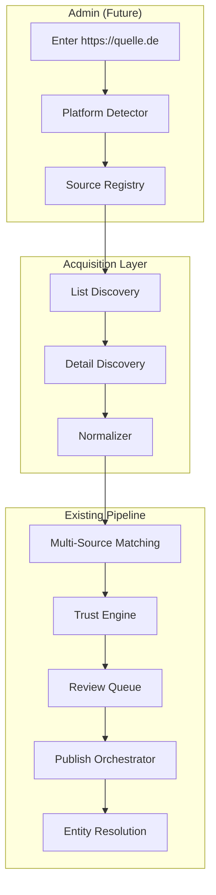

# Generic Ticket Platform Architecture

**Sprint:** 30  
**Status:** Foundation (documentation + vocabulary)  
**Production impact:** None — Bootshaus and Affenkäfig unchanged

---

## Purpose

Introduce a **generic** acquisition layer for ticket platforms (ticket.io, Resident Advisor, Eventbrite, …) without building platform-specific connectors in Sprint 30.

> **2026-07-30:** Ticket Kings is **deprecated** as a strategic source ([deprecation plan](./TICKET_KINGS_DEPRECATION_PLAN.md)). **Ticket.io** is the prioritized ticket platform for discovering new organizers and shops.

Club/organizer websites (Bootshaus, Affenkäfig) remain the primary official sources. Ticket platforms are **secondary enrichment sources** for ticket URLs, pricing, availability, and cross-source duplicate detection — with Ticket.io as the primary platform for net-new discovery.

---

## Repository Audit Summary

### Already Generic

| Layer | Location | Notes |
|-------|----------|-------|
| Source registry | `src/features/sources/domain/source-registry.ts` | Lifecycle, trust, metrics |
| Source types | `src/features/sources/domain/source-types.ts` | `ticket_platform` source type exists |
| Admin categories | `src/features/sources/domain/source-categories.ts` | `ticket_platform` category added Sprint 30 |
| Aggregation connectors | `src/features/aggregation/connectors/` | 8 connector keys, config-driven |
| Website strategies | `html-strategies.ts` | `json_ld`, `html_selector`, `event_detail_page` |
| Import pipeline | `import-aggregation-service.ts` | Source-agnostic |
| Entity resolution | `entity-resolution-writeback.ts` | Alias store, venue/organizer writeback |
| Multi-source matching | `multi-source-match-engine.ts` | Blocking keys, fingerprint scoring |
| Review / trust | `trust-publish-decision-engine.ts` | Policy-driven, per-source trust |
| Scheduler | `import-scheduler-engine.ts` | Generic; gated by connector resolution |
| ER-013 connector contract | `connectors/contracts/` | `AcquisitionCandidate` abstraction |

### Club / Organizer Specific (Data, Not Framework)

| Item | Pattern |
|------|---------|
| Bootshaus | `source-bootshaus-koeln`, `club_website`, `html_selector` config |
| Affenkäfig | `source-affenkaefig`, `organizer_website`, `event_detail_page` + `json_ld` |
| Production seeds | SQL migrations + `production-source-records.ts` mirrors |

No Bootshaus- or Affenkäfig-named parser classes exist. Site specificity lives in `source_config` JSON.

### Gaps (Sprint 30 Scope)

| Gap | Sprint 30 Action |
|-----|------------------|
| `ticket_platform` connector key | Documented; not registered in aggregation registry |
| Platform detection from URL | Documented in Admin Vision / Roadmap |
| Dedicated DB `category` column | Still metadata-only; roadmap item |
| Dual connector architectures | Documented; aggregation path remains production default |

---

## Source Taxonomy

```
SourceType:     ticket_platform     (acquisition channel)
SourceCategory: ticket_platform     (admin classification, Sprint 30)
RegistryType:   ticket_platform     (registry vocabulary)
ConnectorKey:   ticket_platform     (planned; not implemented)
EndpointType:   ticket_platform     (ER-014 endpoints)
```

Legacy category `ticket_provider` remains for backward compatibility.

---

## Generic Acquisition Contract (Overview)

See platform-specific contracts:

- `TICKET_IO_ACQUISITION_CONTRACT.md` — **active (priority platform)**
- `TICKET_KING_ACQUISITION_CONTRACT.md` — **deprecated** (historical reference)

### Contract Phases

```
1. Platform Detection     → hostname / path patterns
2. List Discovery         → shop index, category pages, API
3. Detail Discovery       → per-event canonical URL
4. Normalization          → CanonicalImportEvent
5. Trust Evaluation       → platform trust tier
6. Multi-Source Matching  → link to official website events
7. Review / Publish       → policy per source
```

### Required Fields (Normalized Event)

| Field | Required | Notes |
|-------|----------|-------|
| `externalId` | Yes | Platform-stable ID or canonical URL |
| `originalLink` / `eventUrl` | Yes | Detail page URL |
| `ticketUrl` | Yes | Checkout or shop URL |
| `title` | Yes | |
| `startDate` | Yes | ISO 8601 with timezone |
| `timezone` | Yes | IANA preferred (`Europe/Berlin`) |
| `venueName` | Recommended | |
| `cityName` | Recommended | |
| `organizerName` | Recommended | |
| `imageUrl` | Recommended | |
| `priceAmount` / `priceCurrency` | Optional | Tiered pricing common |
| `sourceMetadata.platform` | Yes | `ticket_io`, `ticket_king`, … |
| `sourceMetadata.shopSlug` | Optional | e.g. `bootshaus-club` |

---

## Duplicate Strategy

Ticket platforms link to the same real-world events as official websites. Matching uses existing blocking keys (`duplicate-candidate-generator.ts`):

| Key | Ticket Platform Use |
|-----|---------------------|
| `url:{ticketUrl}` | Strong when ticket URL already on canonical event |
| `external:{sourceId}:{externalId}` | Per-platform identity |
| `day-venue:{date}:{venue}` | Cross-source merge candidate |
| `day-city:{date}:{city}` | Fallback when venue differs |
| `title-city:{title}:{city}` | Fuzzy cross-source |

Affenkäfig events already carry TicketKings URLs in `ticketUrl` — ticket platform imports would match via `url:` and `day-venue:` keys.

---

## Trust Model (Proposed Defaults)

| Platform Tier | Default Trust | Publish Mode |
|---------------|---------------|--------------|
| Official shop subdomain (ticket.io) | 65–75 | `manual_review` |
| White-label reseller (TicketKings) | 60–70 | `manual_review` |
| Global API (Eventbrite, RA) | 70–80 | `manual_review` → `auto_publish` after calibration |

Ticket data enriches canonical events; official website sources retain higher priority for title, lineup, and lifecycle.

---

## Architecture Diagram



---

## Regression Guarantee

Sprint 30 changes:

- Added `ticket_platform` admin category (vocabulary)
- Added registry type vocabulary
- Documentation only

**Not changed:** Bootshaus connector, Affenkäfig connector, scheduler policies, publish modes, search, discovery, home.

---

## Related Documents

- `TICKET_IO_ACQUISITION_CONTRACT.md` — active
- `TICKET_KING_ACQUISITION_CONTRACT.md` — deprecated
- `TICKET_KINGS_DEPRECATION_PLAN.md`
- `SOURCE_REGISTRY_ROADMAP.md`
