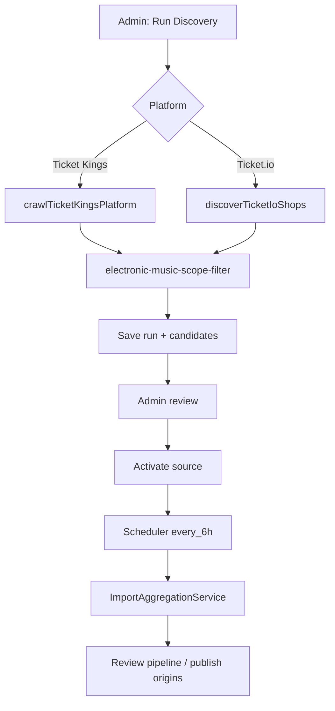

# Ticket Platform Discovery Architecture

> **Product strategy (2026-07-30):** Ticket.io is the **prioritized** ticket platform for discovering new organizers and events. Ticket Kings is **deprecated** — see [TICKET_KINGS_DEPRECATION_PLAN.md](./TICKET_KINGS_DEPRECATION_PLAN.md). Affenkäfig events are covered by the official website source; Ticket Kings added duplicate enrichment only.

## Goal

Discover electronic music events on supported ticket platforms **without** hard-coding one shop per platform. New organizers/shops surface as reviewable source candidates; admins activate them into the existing import scheduler.

## Supported Discovery Modes

| Platform | Status | Mode | Entry point |
|----------|--------|------|-------------|
| **Ticket.io** | **Active — priority** | `shop` | `{slug}.ticket.io` from corpus URL mining |
| Ticket Kings | **Deprecated** | `platform_list` | `https://ticketkings.de/all-events/` |
| Ticket Kings | **Deprecated** | `organizer` | Derived from platform crawl |

## Data Model

- `platform_discovery_runs` — one row per admin-triggered crawl
- `platform_discovery_candidates` — shops, organizers, or platform lists pending review

Candidate lifecycle: `discovered` → `review` (duplicate match) → `activated` (source created)

## Flow

## Reused Components

- `TicketPlatformConnector` — production imports
- `parseTicketKingsShopHtml` / `parseTicketIoShopHtml` — HTML parsing
- `electronic-music-scope-filter` — genre/venue/organizer filtering
- `AdminSourceRepository` — source persistence
- `SourceBackedImportScheduleRepository` — scheduler after activation

## Platform Constraints

### Ticket.io

No public platform-wide event index. Each organizer operates an isolated white-label shop. Discovery is **corpus-driven**: only shops referenced in Eternal Rave data (sources, configs, URLs) are probed.

### Ticket Kings (deprecated)

Single WordPress operator with a public `/all-events/` listing. **No longer pursued strategically** — overlaps with Affenkäfig website imports. Crawler and adapter remain for historical data only until sources are disabled per the deprecation plan.

## Admin Surface

`/admin/sources` → **Platform Discovery** panel:

- Run discovery per platform
- View acceptance/rejection metrics
- Activate candidates (creates source + enables scheduler)

## Security

- RLS: admin-only read/write on discovery tables
- `service_role` grant for operational scripts
- No automatic source activation — admin approval required

## Related Docs

- [SPRINT_33_4_PLATFORM_DISCOVERY_REPORT.md](./SPRINT_33_4_PLATFORM_DISCOVERY_REPORT.md)
- [AUTOMATED_SOURCE_ONBOARDING.md](./AUTOMATED_SOURCE_ONBOARDING.md)
