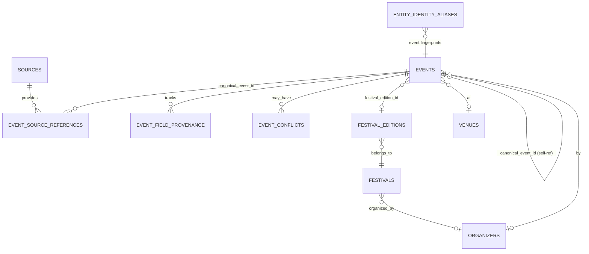

# Sprint 14 — Event Domain Foundation Abschlussbericht

## 1. Analyse des bisherigen Event-Modells

### Bestand nach Sprint 13

| Bereich | Zustand vor Sprint 14 |
|---------|------------------------|
| `public.events` | Zentrale Tabelle mit Lifecycle-Spalten (`cancelled_at`, `published_at`, `canonical_event_id`, …) aus Migration `20260742000000` |
| `event_source_references` | Multi-Source-Verknüpfung mit `unique (source_id, external_event_id)` — keine Duplikate pro Quelle |
| `event_field_provenance` | Schema vorhanden, aber **Publish-Pfad schrieb keine Feld-Provenance** |
| `event_conflicts` / `duplicate_decisions` | Nur Admin-Merge-Pfad (`MergeProvenanceService`) |
| Event Identity | Fingerprinting in `event-identity.ts`, aber **kein `event`-Typ in `entity_identity_aliases`** |
| `canonical_event_id` | DB-Spalte vorhanden, **nicht im Publish-Flow gesetzt** |
| Lifecycle-Timestamps | DB-Spalten vorhanden, **Mapper round-trip fehlte** |
| Festival | **Kein Datenmodell** (nur Source-Rolle `festival`) |
| Venue | ER-009-Foundation (Adresse, Koordinaten, Land), **kein Venue-Typ** |
| Organizer | ER-010-Foundation (Profil-Felder, Social Links) |
| RLS Provenance | **Keine Policies** auf Provenance-Tabellen |

### Fachliche Trennung (Ist-Zustand)

```
Source     → reine Datenherkunft (Konfiguration, Import, Provenance)
Organizer  → eigenständige Entität (`organizers`, `events.organizer_id`)
Venue      → eigenständige Entität (`venues`, `events.venue_id`)
Festival   → bisher nur implizit über Source-Rolle, nicht als Domain-Entität
Event      → kanonische Plattform-Entität, aggregiert Multi-Source-Fakten
```

Die Importarchitektur aus Sprint 13 (Aggregation → Publish-Orchestrator → `ImportEventPublishService`) wurde **nicht neu gebaut**, sondern gezielt erweitert.

---

## 2. Änderungen

### Datenbank-Migration `20260745000000_sprint14_event_domain_foundation.sql`

| Änderung | Zweck |
|----------|-------|
| `festivals` + `festival_editions` | Festival-Serien und Jahresausgaben als eigene Entitäten |
| `events.festival_edition_id` | Events können einer Festival-Edition zugeordnet werden |
| `venues.venue_type` + `is_temporary` | Club, Open Air, Festivalgelände, temporäre Locations |
| `entity_identity_aliases` → `event` | Fingerprint-basierte kanonische Event-Identität vorbereiten |
| RLS auf Provenance-Tabellen | Admin-only Zugriff auf `event_source_references`, `event_field_provenance`, `event_conflicts`, `duplicate_decisions` |

### Anwendungsschicht

| Komponente | Änderung |
|------------|----------|
| `AdminEventRecord` | Lifecycle-Felder, `canonicalEventId`, `festivalEditionId`, `timezone` |
| `event-mapper.ts` | Vollständiger Round-Trip aller Lifecycle-/Canonical-Felder |
| `VenueRecord` + `venue-mapper.ts` | `venueType`, `isTemporary` |
| `EntityType` | um `'event'` erweitert |
| `event-publish-lifecycle.ts` | Setzt `published_at`, `first_published_at`, `last_seen_at`, `last_imported_at`, Absage/Verschiebung |
| `event-field-provenance-writer.ts` | Schreibt Feld-Provenance beim Import-Publish |
| `event-canonical-identity-service.ts` | Fingerprint-Lookup/-Registrierung über `entity_identity_aliases` |
| `ImportEventPublishService` | Lifecycle + Provenance + Canonical Identity im Publish-Flow |
| `festival-foundation.ts` | Domain-Typen für Festival/Edition/VenueType |
| `event-domain-model.ts` | Dokumentierte Entitätsgrenzen |

---

## 3. Neue Beziehungen



### Kernregeln

- **Ein Event, viele Quellen:** `event_source_references` mit `unique (source_id, external_event_id)`
- **Kanonische Identität:** `events.canonical_event_id` zeigt auf sich selbst oder auf Merge-Ziel; Fingerprints in `entity_identity_aliases` (Typ `event`)
- **Festival ≠ Event:** Festival-Edition ist Container; einzelne Shows/Acts bleiben Events
- **Source ≠ Organizer/Venue:** Source liefert Daten; Entitäten werden separat aufgelöst

---

## 4. Architekturdiagramm (Datenfluss)

```
┌─────────────────────────────────────────────────────────────────┐
│                     public.sources (DB)                          │
│   Bootshaus · Affenkäfig · RA · Ticket.io · …                    │
└───────────────────────────┬─────────────────────────────────────┘
                            │ Import (Sprint 13 Pipeline)
                            ▼
┌─────────────────────────────────────────────────────────────────┐
│              import_records → Aggregation Layer                  │
│              PublishDecisionService (auto/manual/conditional)      │
└───────────────────────────┬─────────────────────────────────────┘
                            ▼
┌─────────────────────────────────────────────────────────────────┐
│           ImportEventPublishService (Sprint 14 erweitert)        │
│  ┌──────────────────────────────────────────────────────────┐   │
│  │ 1. resolveExistingEventId (source ref + fingerprint)      │   │
│  │ 2. Event Upsert → public.events                           │   │
│  │ 3. applyEventPublishLifecycle (timestamps, cancel/postpone)│  │
│  │ 4. event_source_references.upsert                         │   │
│  │ 5. EventFieldProvenanceWriter → event_field_provenance    │   │
│  │ 6. EventCanonicalIdentityService → entity_identity_aliases │  │
│  └──────────────────────────────────────────────────────────┘   │
└───────────────────────────┬─────────────────────────────────────┘
                            ▼
┌─────────────────────────────────────────────────────────────────┐
│  Consumer: EventRepository → Discovery Feed (nur published)      │
│  Admin: MergeProvenanceService · ConflictResolutionService       │
└─────────────────────────────────────────────────────────────────┘
```

---

## 5. Begründung der Änderungen

| Entscheidung | Begründung |
|--------------|------------|
| Kein Rebuild der Import-Pipeline | Sprint-13-Architektur ist produktionsreif; Risiko und Scope minimieren |
| Lifecycle im Publish-Pfad | DB-Spalten existierten, wurden aber nie befüllt — Voraussetzung für Absagen, Updates, Trust |
| Feld-Provenance beim Publish | Schema war leer; ohne Writes keine Nachvollziehbarkeit pro Feld |
| Fingerprint in `entity_identity_aliases` | Bestehendes Alias-Modell wiederverwendet; kein paralleles Identity-System |
| `festivals` / `festival_editions` separat | Festival ist Format/Serie, nicht Event-Duplikat; vorbereitet für Stages, Camping, Ticketphasen |
| `venue_type` | Unterscheidung Club / Open Air / Festivalgelände / temporär ohne Venue-Entität zu überladen |
| RLS auf Provenance | Sicherheitslücke geschlossen; Consumer liest aggregierte Events, nicht Roh-Provenance |
| Kein Auto-Matching | Explizit out of scope; Architektur vorbereitet, Entscheidungen bleiben auditierbar |

---

## 6. Verbleibende Schwachstellen

| Schwachstelle | Status | Empfehlung |
|---------------|--------|------------|
| Cross-Source Auto-Merge | Nicht implementiert | Sprint 15+: Matching Engine mit Confidence + Review-Queue |
| Konfliktlösung beim Publish | Nur Architektur | `MergeProvenanceService` bei Multi-Source-Merge nutzen |
| Festival-Verwaltung UI | Nicht implementiert | Admin-CRUD wenn Affenkäfig-Live-Daten verfügbar |
| `festival_edition_id` im Import | Spalte + Typ, kein Auto-Link | Connector-Metadaten → Edition-Matching |
| Stages / Lineup pro Festival | `metadata` jsonb vorbereitet | Dedizierte Tabellen bei Bedarf |
| Organizer-Verifizierung / Teams | Organizer-Modell basisch | ER-011+ Erweiterungen |
| Consumer-Provenance-API | Nicht exponiert | Feld-Herkunft nur Admin; ggf. später „Quelle: Bootshaus" |
| Affenkäfig Live-Fetch | Domain offline | Fixture in DB (Sprint 13) |

---

## 7. Bewertung der langfristigen Skalierbarkeit

| Anforderung | Bewertung |
|-------------|-----------|
| 10.000+ Quellen | ✅ Generische Pipeline, `source_id` FK, priorisierte Merge-Strategie |
| Millionen Events | ✅ Text-IDs, indizierte Lifecycle-/Canonical-Spalten, paginierte Repositories |
| Multi-Source pro Event | ✅ `event_source_references` + Provenance + Conflicts |
| Profile / Folgen | ✅ Events als zentrale FK-Ziele (`venue_id`, `organizer_id`, später `artist_ids`) |
| Ticketing / Scanner | ⚠️ `ticket_url`, Sales-Timestamps vorhanden; kein Ticket-Modell (bewusst) |
| Community / Empfehlungen | ✅ Kanonische Events + Lifecycle für Discoverability |
| Scheduler | ✅ `sources.schedule_*` aus Sprint 8/12 |
| Trust Engine | ⚠️ `trust_score`, Provenance-Grundlage; Engine fehlt |
| Mehrere Länder / Sprachen | ✅ `country`, `timezone`, `locale` in Alias-Store; i18n vorhanden |

**Gesamt:** Die Event-Domain ist als Plattform-Fundament **stabil und erweiterbar**. Die kritischsten Lücken (Lifecycle-Persistenz, Provenance-Writes, Canonical Identity Prep, Festival/Venue-Typisierung, RLS) wurden geschlossen, ohne die Importarchitektur zu ersetzen.

---

## 8. Verifikation

| Check | Ergebnis |
|-------|----------|
| Tests | **941 passed** (+9) |
| Typecheck | ✅ grün |
| Lint | ✅ 0 Fehler |

### Neue Tests

- `sprint14-event-domain-migration.test.ts`
- `sprint14-event-domain.test.ts` (Mapper, Lifecycle, Identity, Provenance)

---

## 9. Erfolgskriterien

| Kriterium | Status |
|-----------|--------|
| Event ist zentrale Plattform-Entität | ✅ |
| Mehrere Quellen → ein Event | ✅ (Schema + Publish; Merge manuell/automatisch vorbereitet) |
| Organizer sauber getrennt | ✅ |
| Venue sauber getrennt | ✅ (+ venue_type) |
| Festival vorbereitet | ✅ |
| Source bleibt reine Datenherkunft | ✅ |
| Eventmodell langfristig stabil | ✅ |
| Keine Architekturbrüche | ✅ |
| Tests / Typecheck / Lint | ✅ |

---

## 10. Neue und geänderte Dateien

### Neu

- `supabase/migrations/20260745000000_sprint14_event_domain_foundation.sql`
- `src/features/events/domain/festival-foundation.ts`
- `src/features/events/domain/event-domain-model.ts`
- `src/features/import/services/event-publish-lifecycle.ts`
- `src/features/import/services/event-field-provenance-writer.ts`
- `src/features/events/services/event-canonical-identity-service.ts`
- `src/data/__tests__/sprint14-event-domain-migration.test.ts`
- `src/features/events/__tests__/sprint14-event-domain.test.ts`
- `docs/real-data/PHASE_14_REPORT.md`

### Geändert

- `src/data/types/records.ts` — `AdminEventRecord`, `VenueRecord`
- `src/data/mappers/event-mapper.ts` — Lifecycle Round-Trip
- `src/data/mappers/venue-mapper.ts` — `venueType`, `isTemporary`
- `src/features/entity-resolution/types.ts` — `EntityType` + `event`
- `src/features/import/services/import-event-publish-service.ts` — Lifecycle, Provenance, Identity
- `src/data/repositories/registry.ts` — Wiring
- `src/features/aggregation/__tests__/in-memory-multi-source-repositories.ts` — Provenance-Persistenz für Tests
